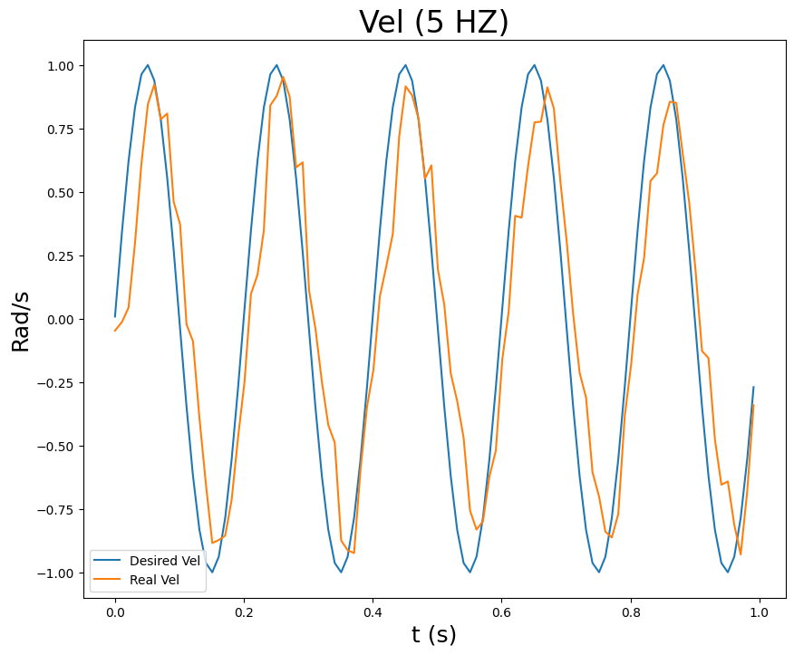
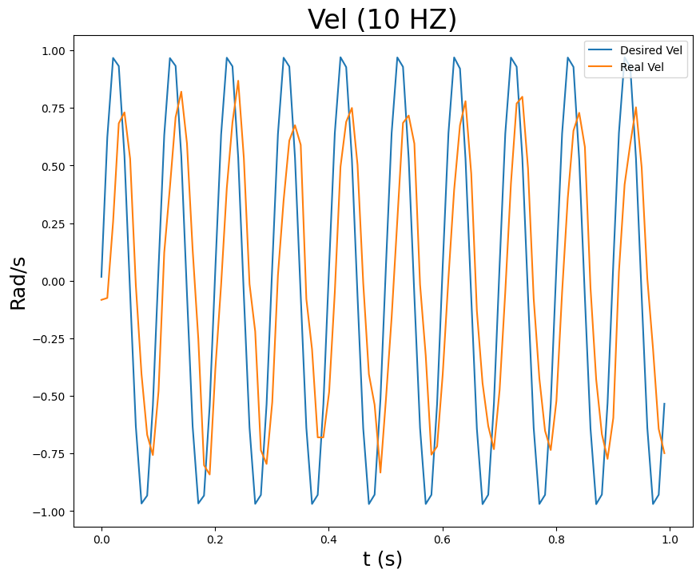
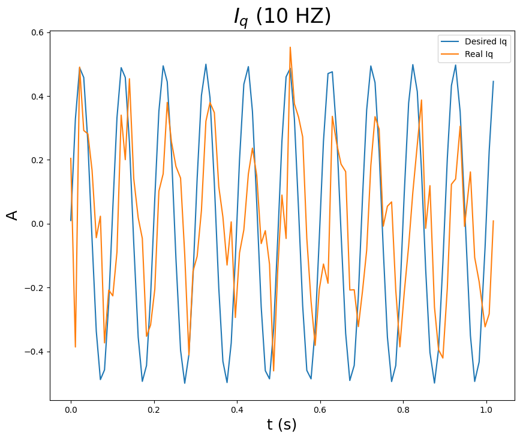
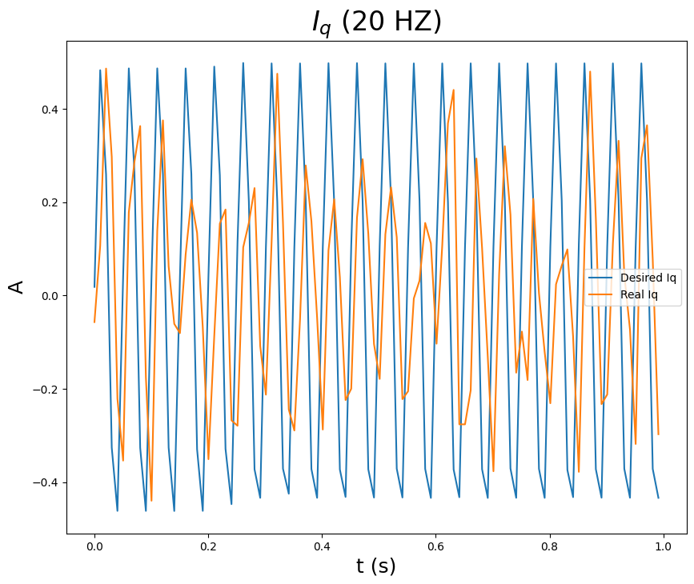

# XIAOMI CyberGear Async API

Python Async API For Xiaomi CyberGear Micro Motor

Inspired by other sync python lib for CyberGear, the async api allows users to control motor in async framework, enabling real-time control and swift response.

#### *Note that: The repo is not fully constructed, and some codes could be optimized and some bugs should be fixed.* 

#### The main features are:

- Efficient: Support Async Framework
- Flexible: Separate CAN Command Sending And Receiving Processes
- Friendly: Simple To Use, Easy To Modify

### Installation

Don't worry, the CyberGear Async API is easy to install

1. Install python if you don't have yet
    - Anaconda is recommended to be used. [Here is how to install it.](https://docs.anaconda.com/anaconda/install/)
    - Once you have Anaconda, you can run
    ```sh
    conda create -n cyberController python=3.12.2
    ```
    - After installation, you should activate it,
    ```sh
    conda avtivate cyberController
    ```
2. Clone this repo or download the zip file
3. Enter the folder
    ```sh
    cd CyberGearAsyncAPI
    ```
4. Install the dependencies for CyberGearAsyncAPI
    ```sh
    pip install -r requirements.txt
    ```

### Usage
1. Enable async environment and import CyberGear Async API

    ```python
    import asyncio
    import aioserial
    from cyberGearAsyncAPI import CANMotorAsyncController
    ```

2. Initial aioserial and CANMotorAsyncController instance
    ```python
    serial_port: str = "Your Serial Port"
    motor_id: int = 1 # Your Motor CAN ID
    main_can_id:int = 253 # Your CAN Connector ID
    aioserial_instance: aioserial.AioSerial = aioserial.AioSerial(port=serial_port, baudrate=921600)

    cyberGear = CANMotorAsyncController(aioserial_instance, motor_id=motor_id, main_can_id=main_can_id)
    ```

3. Set zero point for motor
    ```python
    await cyberGear.async_set_0_pos()
    ```

4. Enjoy CyberGear in debugging way
    ```python
    await cyberGear.async_enable() # Enable motor
    await cyberGear.async_set_mode(mode=3) # Set motor run mode

    await cyberGear.async_write_property(index=0x7006, value=I_q, data_type='f') # Set target q axis target current

    await asyncio.sleep(1) # Run the above command for 1 second
    angle, speed, torque = cyberGear.Motor_Status # Retrieve motor current status (angle, speed and torque)

    await cyberGear.async_disable() # Disable motor

    ```

5. Production code workflow instance
    - Current Mode
        ```python
        await cyberGear.async_enable() # Enable motor
        await cyberGear.async_set_mode(mode=3) # Set motor run mode

        try:
            while loop_condition: # Set run loop condition
                # Set break loop condition, such like the speed is over maximum value.
                if break_condition: 
                    await cyberGear.async_disable() # Disable motor
                    break
                # Set target q-axis current for motor, the index value 0x7006 can be found in manual
                await cyberGear.async_write_property(index=0x7006, value=I_q, data_type='f')  

                await asyncio.sleep(0.002) # Meet your control frequency
                
                angle, speed, torque = cyberGear.Motor_Status # Retrieve motor current status (angle, speed and torque)

        # You can set other interrupt method
        except KeyboardInterrupt: 
            await cyberGear.async_disable()
        
        finally:
            await cyberGear.async_disable() 
        ```
    
    - Speed Mode
        ```python
        await cyberGear.async_enable() # Enable motor
        await cyberGear.async_set_mode(mode=2) # Set motor run mode

        try:
            while loop_condition: # Set run loop condition
                # Set break loop condition, such like the speed is over maximum value.
                if break_condition: 
                    await cyberGear.async_disable() # Disable motor
                    break
                # Set target speed for motor, the index value 0x700A can be found in manual
                await cyberGear.async_write_property(index=0x700A, value=S_t, data_type='f')  

                await asyncio.sleep(0.002) # Meet your control frequency

                angle, speed, torque = cyberGear.Motor_Status # Retrieve motor current status (angle, speed and torque)

        # You can set other interrupt method
        except KeyboardInterrupt: 
            await cyberGear.async_disable()
        
        finally:
            await cyberGear.async_disable() 
        ```

    - Position Mode
        ```python
        await cyberGear.async_enable() # Enable motor
        await cyberGear.async_set_mode(mode=1) # Set motor run mode

        try:
            while loop_condition: # Set run loop condition
                # Set break loop condition, such like the speed is over maximum value.
                if break_condition: 
                    await cyberGear.async_disable() # Disable motor
                    break
                # Set target position for motor, the index value 0x7016 can be found in manual
                await cyberGear.async_write_property(index=0x7016, value=P_t, data_type='f')  

                await asyncio.sleep(0.002) # Meet your control frequency

                angle, speed, torque = cyberGear.Motor_Status # Retrieve motor current status (angle, speed and torque)

        # You can set other interrupt method
        except KeyboardInterrupt: 
            await cyberGear.async_disable()
        
        finally:
            await cyberGear.async_disable() 
        ```

### Motor Test
1. Velocity Control Test

    Test Code:
    ```python
    import time
    import asyncio
    import numpy as np
    import matplotlib.pyplot as plt

    def cal(f, t):
        return 1*np.sin(2*np.pi*f*t)

    T = 0.01
    frequency = 10
    V_d = []
    V_r = []
    times = []

    await asyncio.sleep(1)
    await cyberGear.async_set_0_pos()
    await cyberGear.async_enable()
    await cyberGear.async_set_mode(mode=2)

    s = time.time()

    try:
        while True:
            e = time.time()
            vd = cal(frequency, e-s)
            await cyberGear.async_write_property(index=0x700A, value=vd, data_type='f')    
            V_d.append(vd)
            V_r.append(cyberGear.Motor_Status[1])
            times.append(e)
            await asyncio.sleep(T)
    except KeyboardInterrupt:
        print("Program terminated")
        await cyberGear.async_disable()
    finally:
        await cyberGear.async_disable()

    

    # In[]
    pp = 100
    plt.figure(figsize=(10, 8))

    plt.title("Vel (10 HZ)", fontsize=24)
    plt.xlabel("t (s)", fontsize = 18)
    plt.ylabel("Rad/s", fontsize = 18)
    plt.plot(np.round(np.array(times)-times[0], 4)[:pp], V_d[:pp])
    plt.plot(np.round(np.array(times)-times[0], 4)[:pp],V_r[:pp])
    plt.legend(("Desired Vel", "Real Vel"))
    ```

    If we set 5Hz speed control for motor, then we can retrieve the following graph,
    <p align="center">
    
    </p>

    If we set 10Hz speed control for motor, then we can retrieve the following graph,
    <p align="center">
    
    </p>

2. Current Control Test

    Test Code:
    ```python
    import time
    import asyncio
    import numpy as np
    def cal(f, t):
        return 1*np.sin(2*np.pi*f*t)

    T = 0.01
    frequency = 10
    Iq_d = []
    Iq_r = []
    times = []

    await asyncio.sleep(1)
    await cyberGear.async_set_0_pos()
    await cyberGear.async_enable()
    await cyberGear.async_set_mode(mode=3)

    s = time.time()

    try:
        while True:
            e = time.time()
            iqd = cal(frequency, e-s)
            await cyberGear.async_write_property(index=0x7006, value=vd, data_type='f')    
            await asyncio.sleep(0.005)
            await cyberGear.async_read_property(index=0x701A, data_type='f')
            Iq_d.append(iqd)
            Iq_r.append(cyberGear.IndexValue)
            times.append(e)
            await asyncio.sleep(T-0.006)
    except KeyboardInterrupt:
        print("Program terminated")
        await cyberGear.async_disable()
    finally:
        await cyberGear.async_disable()

    

    # In[]
    pp = 100
    plt.figure(figsize=(10, 8))

    plt.title("$I_q$ (10 HZ)", fontsize=24)
    plt.xlabel("t (s)", fontsize = 18)
    plt.ylabel("A", fontsize = 18)
    plt.plot(np.round(np.array(times)-times[0], 4)[:pp], Iq_d[:pp])
    plt.plot(np.round(np.array(times)-times[0], 4)[:pp],Iq_r[:pp])
    plt.legend(("Desired $I_q$", "Real $I_q$"))
    ```

    If we set 10Hz current control for motor, then we can retrieve the following graph,
    <p align="center">
    
    </p>

    If we set 20Hz current control for motor, then we can retrieve the following graph,
    <p align="center">
    
    </p>

